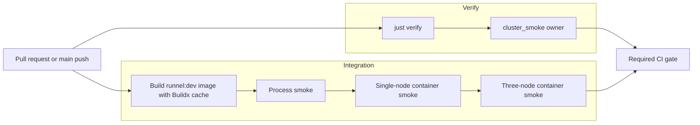
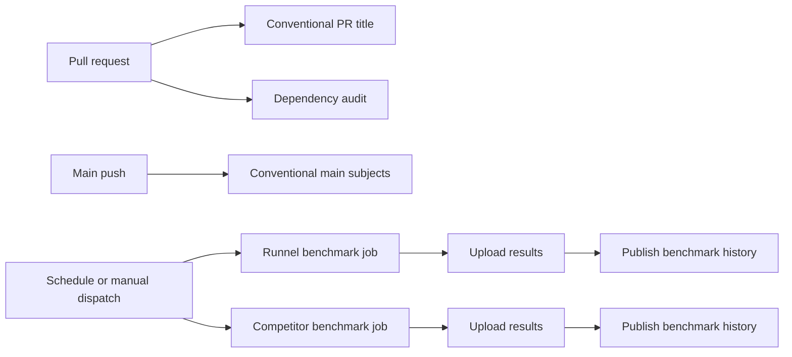

# CI pipeline DAG

The required pull-request gate is intentionally modeled as a small DAG so that
coverage has one owner and independent work can run concurrently:

`Verify` and `Integration` have no data dependency, so GitHub Actions runs
them on separate runners. The pull request is mergeable only when both required
jobs pass. `cluster_smoke` is included once through `just verify`; the
integration job does not invoke it again.

The integration job sets `CARGO_TARGET_DIR=target` at the job level, before
`Swatinem/rust-cache` runs. The action's default workspace mapping is `. -> target`,
so the integration Cargo target is now eligible for the same
dependency-artifact caching behavior as the normal workspace target. The jobs
keep separate cache keys because `Verify` runs all-feature Clippy while
`Integration` runs the default-feature process checks; combining those mutable
target contents would introduce cache races and incomplete feature coverage.

The Docker image is built once by the integration job's Buildx step. Both
container smoke workflows consume that exact `runnel:dev` image. Standalone
isolated container benchmark workflows retain their existing behavior of
building an isolated image when no integration image marker is present.

## Coverage ownership

| Job | Owns | Does not duplicate |
| --- | --- | --- |
| Verify | formatting, Clippy, workspace tests, docs, ShellCheck, benchmark-script tests, workspace build, and `cluster_smoke` | container lifecycle checks |
| Integration | process smoke, prebuilt-image validation, single-node container smoke, and three-node container smoke | `cluster_smoke` |

The integration stages remain sequential within their job because they use the
same prepared image and because deterministic failure localization is more
valuable here than speculative intra-job parallelism. The job-level parallelism
provides the large wall-clock reduction without making the resource-heavy
container checks compete on one runner.

## Supporting workflow DAGs

The other automation remains separate from the required PR execution path:

The benchmark-history concurrency group serializes the two history publishers;
the benchmark jobs themselves are not PR gates. This keeps long, noisy
measurements and their write-capable publishing step out of the fast required
path while preserving scheduled and manually triggered evidence collection.
